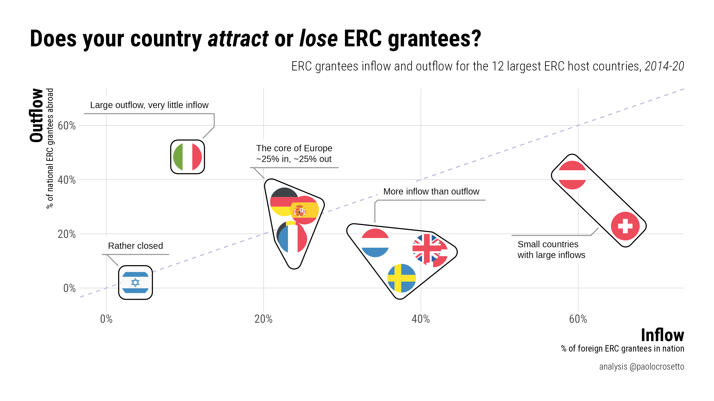
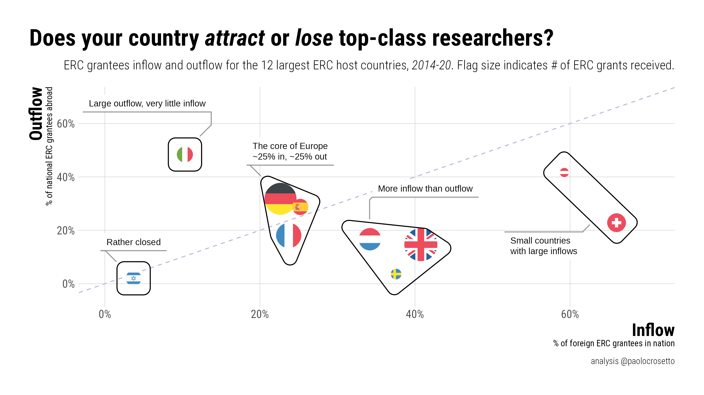
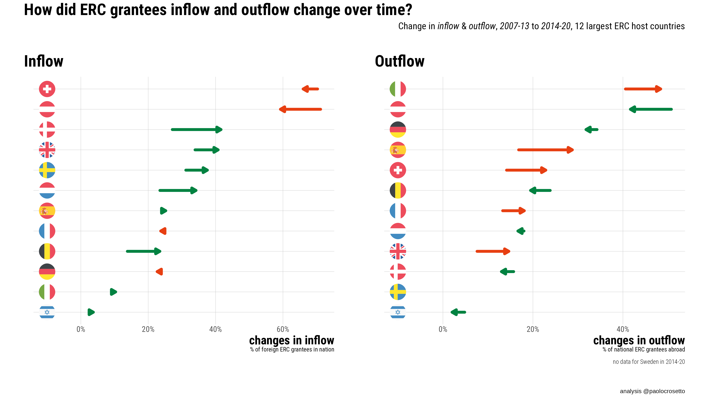
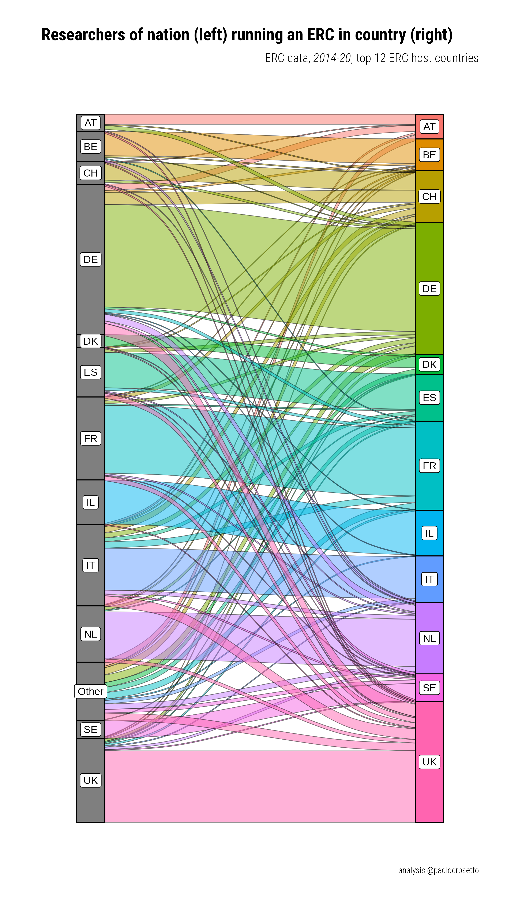

# ERC_inflow_outflow

Repository to hold the ERC data and the plot of the attractiveness of EU countries in term of ERC grantees.\
**In the first version of the plot that was circulated there was a honest but terrible mistake, I mistook the country code "IL" to mean Ireland -- but it means Israel**.\
This repo contains the correct script & plot, but also the bad ones in a hall of shame to remind my future self of triple-checking before tweeting.

## Dependencies

The script depends on `tidyverse` and several `ggplot` extensions -- nothing else

## Data

Data were shared by the ERC based on official ERC data, aggregated over several years to ensure the privacy of PIs.

## Correct plots

Not adjusting flag size by number of ERC hosted projects

Here flags are adjusted to indicate number of projects run in the country (Belgium disappears behind France).

## Evolution of inflow and outflow

## Alluvial plot of all movements

