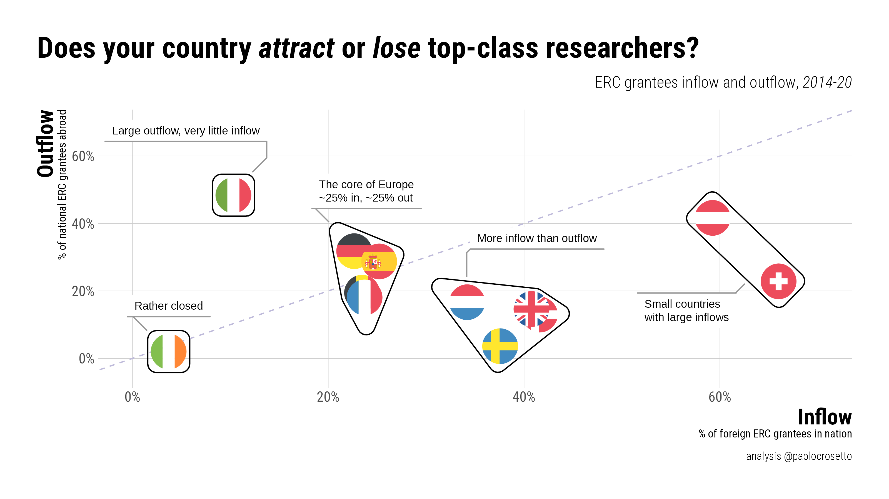
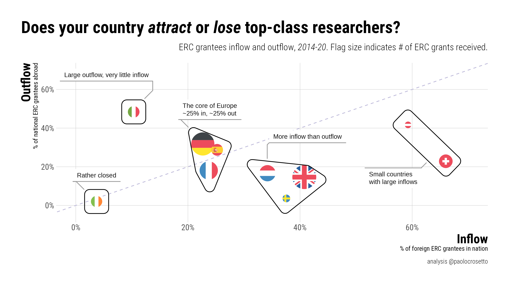

# ERC_inflow_outflow

Repository to hold the ERC data and the plot of the attractiveness of EU countries in term of ERC grantees

## Dependencies

The script depends on `tidyverse` and several `ggplot` extensions -- nothing else

## Data

Data were shared by the ERC based on official ERC data, aggregated over several years to ensure the privacy of PIs.

## Tweet

The plot has been share on Twitter here: <https://twitter.com/PaoloCrosetto/status/1601543398200311809?s=20&t=FFxWHl2U2w82rdXMsbI8Tw>

## Plot

## Size-adjusted plot

Here flags are adjusted to indicate number of projects run in the country.

